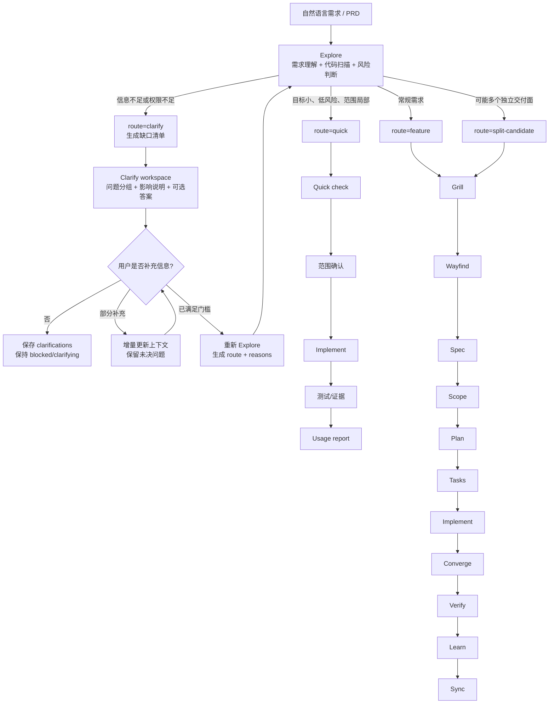
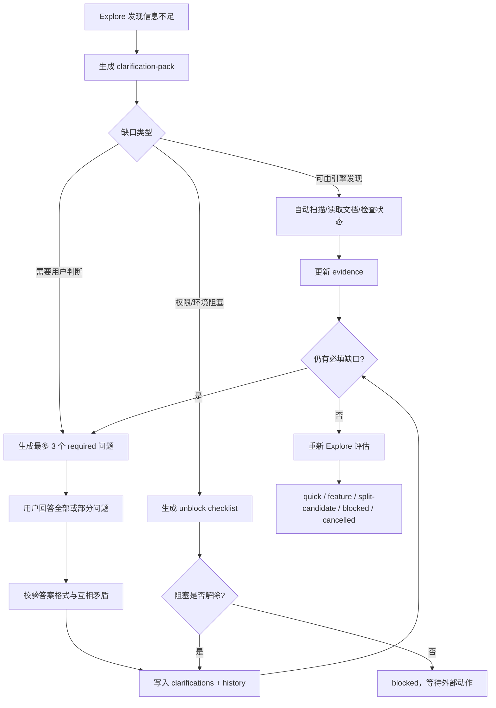
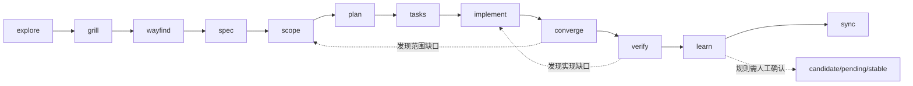
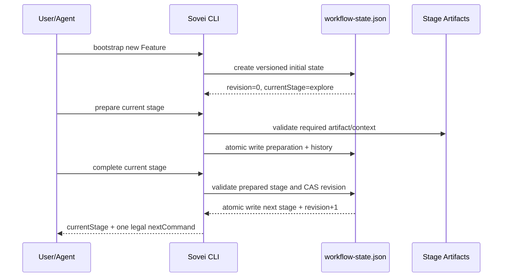
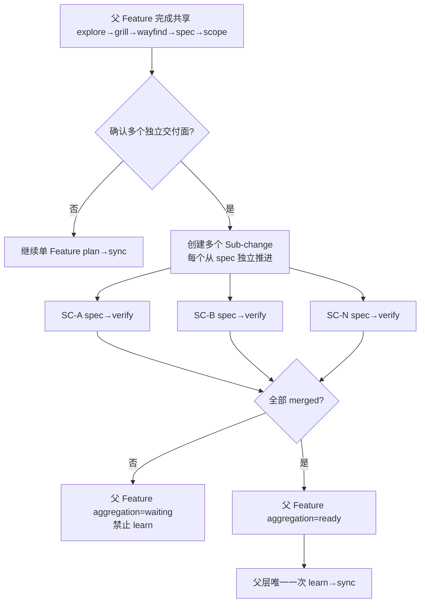
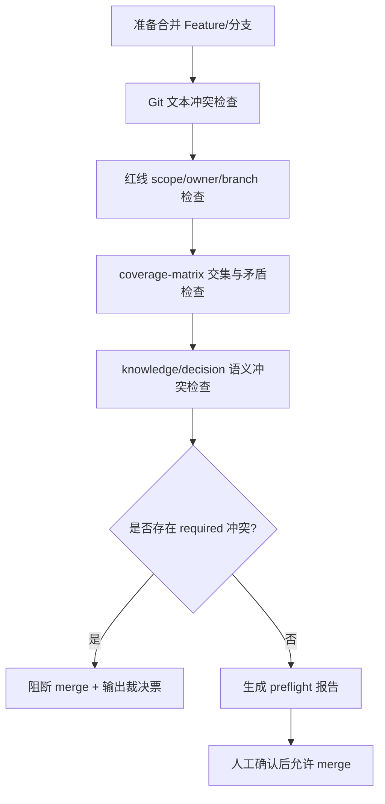

# Sovei Engine PRD

**版本**：0.1 Draft  
**日期**：2026-08-17  
**产品负责人/开发负责人**：Sovei Engine 维护者  
**依据**：`DEV_BACKLOG.md`、`doc/DEV_ARCHIVE.md`、`design-docs/SOVEI_HARNESS_WORKFLOW_DESIGN.md`、`specs/003-new-feature-workflow-state/`

## 1. 产品定义

Sovei 是一个面向个人开发者和多工程协作场景的 AI 开发工作流引擎。它不替代 IDE Agent，而是把自然语言需求转换为可恢复、可审计、可验证的工程执行过程：明确需求，发现决策，计算影响面，形成规格与任务，实施变更，收敛验证，并将有证据的经验沉淀为可复用知识。

产品的核心不是“多生成一些文档”，而是让 Agent 在长周期开发中始终知道四件事：当前需求是什么、当前处于哪个阶段、下一步是否合法、交付是否有证据。

## 2. 当前产品基线

| 维度 | 当前事实 |
|---|---|
| 当前版本 | `2.6.1`，以 `packages/sovei-core/package.json` 为准 |
| 工作流 | `explore → grill → wayfind → spec → scope → plan → tasks → implement → converge → verify → learn → sync` |
| 已完成能力 | 12 阶段工作流、Feature split 方向 C、知识生命周期、IDE 适配器、Skills 注入、scanner polish、架构扫描、workspace/preflight 基础能力 |
| 当前活跃 Feature | 无；`001-scanner-polish` 已完成，3 个 Sub-change 已 merged |
| 当前唯一开发主线 | `R1.1 Workflow v3 状态核心` |
| 当前主要风险 | 状态事实源重叠、split 聚合协议、Explore/Quick 路由、增量扫描名实不符、知识膨胀、架构信号尚未注入工作流 |
| 运行环境 | CommonJS；运行时 Node.js >= 14.18；构建/测试需 Node.js 18+ |

`doc/DEV_ARCHIVE.md` 记录的是历史完成项和旧设计差距，不能覆盖 `DEV_BACKLOG.md` 的最新状态。后续产品判断以源码、当前 Feature 产物和 `DEV_BACKLOG.md` 为准，历史文档只用于理解演进原因。

## 3. 用户与核心问题

### 3.1 目标用户

主要用户是同时维护多个项目、分支或 Agent 宿主的个人开发者。用户既需要产品视角来决定“为什么做、做到什么程度”，也需要开发视角来决定“改哪些模块、如何验证、何时停止”。

### 3.2 用户痛点

1. 需求、状态、Markdown 产物和事件记录互相重叠，用户无法确认哪个是真相。
2. 长任务跨会话后，Agent 容易重复工作、跳阶段或依据过期文档实现。
3. 一个 Feature 拆成多个 change 后，父 Feature 和子 change 的完成状态可能漂移。
4. Quick 可以在需求尚未经过 Explore 理解前启动，轻量路径缺少准入门槛。
5. 扫描虽然支持 changed files 过滤，但底层仍执行全量扫描，性能语义不准确。
6. 多工程同步能同步知识，却不能系统识别红线、coverage 和决策之间的语义冲突。
7. 外部 Skill 能提供方法，但来源、版本、权限和升级过程尚未形成完整产品闭环。

## 4. 产品目标与非目标

### 4.1 目标

- 建立一个机器可读、可版本化、可审计的 Workflow 唯一事实源。
- 让所有需求先经过 Explore，再根据风险进入 Quick、正式 Feature、split-candidate 或澄清闭环。
- 对信息不足的需求提供可恢复的澄清工作台：自动识别缺口、生成带上下文的问题、支持用户分批回答、回答后重新评估，而不是简单停在 `blocked`。
- 保持每次调用只推进一个合法阶段，并提供唯一下一步命令。
- 让 split 具有显式父子关系、执行范围和聚合状态。
- 把影响面、架构债务、红线、验证证据和知识沉淀接入同一条交付链。
- 让 IDE/Agent 适配器只承担宿主转换，不改变 Sovei 的核心协议。
- 为外部 Skills 提供固定版本、审查、安装、回放和升级边界。

### 4.2 非目标

本 PRD 不要求 Sovei 成为完整 IDE Agent、中心化 LLM 调度平台或自动替用户做产品决策的系统。本阶段不同时开发 MCP Server、统一关系图谱、联邦多 Hub、Cursor Adapter 和所有语言扫描能力，也不迁移旧 Feature 数据。

## 5. 产品原则

1. **唯一事实源优先**：机器状态不能从 Markdown、聊天记录或历史事件推断。
2. **阶段门禁优先**：没有当前阶段产物、确认或验证证据，就不能进入下一阶段。
3. **事实与判断分离**：结构事实可自动检查，语义判断必须带理由和证据。
4. **人工掌握不可逆决策**：规则晋升、重大范围变化、稳定知识和高风险合并保留人工闸门。
5. **失败可诊断**：错误必须说明状态、操作、原因和修复方向，不能静默 fallback。
6. **外部能力不改变 SOP**：外部 Skill 是输入和增强，不直接改写 Sovei 阶段契约。

## 6. 核心用户流程

### 6.1 统一需求入口



### 6.2 信息不足：Clarify 闭环

`blocked` 不应只是终点，而应表示“当前不能安全推进，但可以通过补充信息恢复”。因此产品上将其拆成两个状态：`clarifying` 表示引擎已经生成可回答的问题；`blocked` 表示存在权限、环境或外部依赖阻塞，用户即使补充描述也不能继续。两者都必须持久化在 Feature 的结构化状态中。

#### 6.2.1 信息缺口分类

| 缺口类型 | 典型问题 | 引擎动作 | 是否允许进入正式流程 |
|---|---|---|---|
| 目标缺口 | 要解决什么问题、成功是什么 | 生成目标澄清题和验收结果题 | 否 |
| 用户/场景缺口 | 谁使用、何时使用、异常场景 | 生成角色、旅程、边界场景题 | 否 |
| 范围缺口 | 改哪些项目、模块、入口 | 扫描候选路径，要求确认允许范围 | 否 |
| 约束缺口 | 兼容性、性能、安全、权限、合规 | 列出受影响约束并要求选择或确认 | 否 |
| 方案缺口 | 多个可行方案尚未决策 | 转入 `grill` 决策问题，不让模型擅选 | 否，先 grill |
| 验收缺口 | 无法判断做完与否 | 生成 Given/When/Then 验收问题 | 否 |
| 环境缺口 | 项目、分支、运行命令、依赖不可访问 | 生成环境检查任务 | 环境满足后重新 Explore |
| 权限缺口 | 无法读取目录、执行测试或访问服务 | 标记 `blocked`，输出权限动作 | 权限恢复后重新 Explore |
| 冲突缺口 | 当前需求与红线、Feature 或稳定知识冲突 | 输出冲突证据和裁决选项 | 需要裁决后继续 |

#### 6.2.2 Clarify 工作台

每次 Explore 不应只输出一句“信息不足”，而应生成 `clarification-pack`，至少包含：

- `status`：`clarifying` 或 `blocked`；
- `questions`：问题 ID、缺口类型、问题正文、为什么需要、影响哪些路由；
- `priority`：`required`、`recommended`、`optional`；
- `answerType`：单选、多选、文本、路径、确认、命令输出；
- `options`：当引擎能给出合理候选时，提供选项和推荐项；
- `evidence`：引擎已经查到的事实，避免重复询问用户可由代码或文档回答的问题；
- `assumptions`：当前临时假设、风险和撤销方式；
- `allowedPaths`、`riskSignals`、`nextAction`：回答后重新路由所需的结构化字段；
- `round` 与 `answeredAt`：支持多轮澄清并保留审计记录。

问题生成必须遵循“先查事实，再问判断”。例如项目中已经存在唯一入口时，不能问“入口在哪里”；应直接报告扫描事实，再询问“是否只允许修改该入口及其调用链”。

#### 6.2.3 澄清问题分层

```text
第 0 层：引擎可自动发现
  项目根目录、包名、入口、已有测试、相关模块、红线和当前分支

第 1 层：用户必须确认
  目标用户、成功标准、允许范围、兼容边界、是否接受破坏性变化

第 2 层：产品决策
  业务优先级、过渡态/终态、异常策略、权限和数据策略

第 3 层：技术决策
  方案取舍、状态模型、接口契约、迁移策略、性能预算
```

引擎应尽量一次只展示一组最高优先级问题，默认不超过 3 个 `required` 问题。问题之间存在依赖时，先问上游问题；例如没有确认“是否允许破坏性变更”，不能继续询问迁移方案。用户可以提交部分答案，已回答内容立即写入状态，未回答项继续保留，不得丢失上下文。

#### 6.2.4 澄清后的路由规则

| 条件 | 路由 | 下一步 |
|---|---|---|
| 必填问题未回答 | `clarifying` | `clarify answer <feature>` |
| 需要用户授权或环境修复 | `blocked` | `clarify unblock <feature>` |
| 已确认目标、范围和验收，且低风险 | `quick` | `quick run <feature>` |
| 已确认目标，但仍存在方案决策 | `feature` | `workflow grill <feature>` |
| 发现多个独立交付面 | `split-candidate` | `workflow grill <feature>` |
| 澄清后发现需求无效或取消 | `cancelled` | 记录原因并结束，不进入实施 |

任何一次澄清都必须触发重新评估，而不是直接把 Feature 推进到用户可能未准备好的阶段。重新评估结果应记录 `previousRoute`、`route`、`routeReasons` 和导致变化的答案 ID。

#### 6.2.5 澄清工作流图



#### 6.2.6 澄清验收标准

- 信息不足时必须产生结构化 `clarification-pack`，不能只返回自然语言提示。
- 每个 `required` 问题必须说明缺口类型、原因、答案格式和影响的路由。
- 用户部分回答后，已回答内容、未决问题、轮次和审计记录均保留。
- 引擎能从代码、配置或文档确认的事实不得重复询问用户。
- 答案冲突、格式错误和过期答案必须明确拒绝，并指出需要重新回答的题目。
- 澄清完成后必须重新运行 Explore，路由只能来自新的结构化评估结果。
- 缺少权限或环境不可用时标记 `blocked`，不得伪装成普通需求不清晰。
- 澄清过程中不得修改业务代码，不得跳过 `grill`、`scope` 或其他正式阶段门禁。

### 6.3 正式 Feature 十二阶段



### 6.3 Workflow v3 状态核心（当前第一优先级）



### 6.4 Split 聚合



### 6.5 多工程语义合并预检（后续）



## 7. 当前产品判断：先解决什么问题

### 7.1 结论

Sovei 当前最先要解决的不是“再增加一个 Skill、一个 Adapter 或一个高级图谱能力”，而是解决一个更基础的产品问题：

> **当用户提出一个不完整或复杂的需求时，Sovei 能不能可靠判断“现在是否可以继续、还缺什么、下一步应该做什么”，并把这个判断保存下来？**

这也是产品视角和开发视角的共同断点。产品上，用户不知道需求是否已经准备好；开发上，Agent 不知道哪些信息可以假设、哪些必须确认。只要这个断点没有解决，继续扩展 split、架构治理、外部 Skills 或多 Agent 适配，都会把不确定性继续放大。

### 7.2 第一优先级：需求进入与恢复闭环

第一阶段应形成一个可独立使用的最小闭环：

```text
自然语言需求
  → Explore：自动理解、扫描事实、识别风险
  → Clarify：发现信息缺口，生成问题和候选答案
  → 用户回答/补充/授权
  → Reassess：重新评估
  → 输出唯一下一步：Quick / Grill / Blocked / Cancelled
```

这个闭环的产品价值是让用户从“我不知道怎么描述需求”进入“引擎告诉我还缺什么，并且能继续推进”。在此之前不追求一次性生成完整 PRD，也不让 Agent 根据猜测直接进入实施。

### 7.3 工程实现顺序与产品顺序的区别

产品上最先交付的是“Explore + Clarify + Reassess 的可恢复闭环”；工程上仍必须先完成最小的 Workflow v3 状态核心，因为澄清过程需要保存问题、答案、假设、路由、阻塞原因和审计历史。两者不是矛盾关系：

| 层面 | 先解决的问题 | 目的 |
|---|---|---|
| 产品 | 需求不完整时如何继续推进 | 让用户获得明确下一步，减少盲目实现 |
| 工程 | 状态、路由、澄清记录存在哪里 | 让多轮澄清和跨会话恢复可信 |
| 质量 | 如何证明路由不是模型猜测 | 保存证据、理由、风险信号和答案来源 |

### 7.4 推荐路线

| 顺序 | Feature/里程碑 | 优先级 | 产品交付 |
|---|---|---:|---|
| 0 | R1.1 Workflow v3 最小状态核心 | P0 | 新 Feature 的状态唯一来源；支持 `route`、`nextAction`、`clarifying`、`blocked`、`history`，暂不扩展全部 CLI |
| 1 | R1.3 Explore + Clarify MVP | P0 | 需求理解、事实扫描、缺口分类、问题包、部分回答、重新评估、唯一下一步 |
| 2 | R1.3 Quick/Feature 路由收敛 | P0 | `quick` 只能消费已确认上下文；普通需求进入 `grill`；越界时升级而不是硬做 |
| 3 | R1.2 split 聚合 | P1 | 在需求已经被理解后，正确管理多个独立 change 的父子状态和聚合门禁 |
| 4 | P1-6 真增量扫描 | P1 | 无变更复用产物，真实变化才触发重扫 |
| 5 | P2-12 架构信号注入 | P1 | 把架构债务从独立命令接入 scope/plan/converge/verify |
| 6 | P1-4 知识价值阈值 | P1 | 只有有证据、有复用价值的观察才进入知识生命周期 |

现有开发清单将 R1.2 排在 R1.3 之前，主要是状态模型依赖和历史 split 协议修复的工程安排。产品排期可以先验证 R1.3 的单 Feature 路由闭环，但在 R1.2 完成前，`split-candidate` 只允许进入正式 `grill`，不能执行真正的 split。这样既验证最重要的用户价值，也不把未稳定的 split 机制带入新需求。

### 7.5 第一阶段明确不解决的问题

第一阶段不解决“所有需求自动拆成多个 change”、完整 Graph Coding、MCP Server、联邦星型、外部 Skill 自动升级和全量架构治理。它只需要回答并持久化五件事：

1. 用户想解决什么问题；
2. 引擎已经从项目中确认了什么事实；
3. 还缺哪些必须回答的信息；
4. 当前风险和允许修改范围是什么；
5. 用户下一步应该执行哪一个合法动作。

### R1：先解决状态和路由，避免继续叠加旧模型

| 顺序 | Feature | 优先级 | 交付目标 |
|---|---|---:|---|
| 1 | R1.1 Workflow v3 状态核心 | P0 | `workflow-state.json` 成为新 Feature 的唯一事实源；严格转移、revision/CAS、history、原子写 |
| 2 | R1.3 Explore→Quick + Clarify 路由 MVP | P0 | 所有需求先 Explore；信息不足进入可恢复澄清闭环；Quick 只消费已确认的 `route=quick` 上下文 |
| 3 | R1.2 split 聚合 | P1 | 显式 `mode`、`aggregation`、execution scope；父层不伪造 `learn` |

### P1：提升正确性和效率

| 项 | 交付目标 |
|---|---|
| rescan 真增量 | 无变更时复用产物；配置/依赖变化触发全量回退 |
| 知识价值阈值 | 最少证据数、复用次数和候选门槛确定性执行 |
| 架构信号注入 | scope/plan/converge 读取 module metrics 与 debt register；verify 可选 architecture check |
| `--json` 全覆盖 | 让 CI、IDE Adapter 和外部 Agent 消费结构化结果 |

### P2/P3：按真实需求启动

外部 Skills 多 binding、reference 按需加载、上下文预算、Cursor Adapter、Python 扫描、CI 模板、usage 脱敏、联邦星型和统一关系模型不进入 R1，只有在前置能力稳定且有真实使用证据时启动。

## 8. R1.1 产品需求

### 用户故事

作为正在创建新 Feature 的开发者，我希望 `bootstrap/status/prepare/complete` 只读取和更新 `workflow-state.json`，这样我可以在新会话中可靠恢复进度，而不依赖旧事件、YAML 或 Markdown 猜测状态。

作为产品负责人和开发者，我希望需求信息不足时引擎能主动发现缺口、给出有上下文的选项、允许我分批回答，并在回答后重新判断路线，这样我不需要自己猜应该补充什么，也不会因为一次信息不完整而丢失整个需求。

### 必须满足的验收标准

- 新 Feature bootstrap 创建包含 `schemaVersion`、身份、状态、当前阶段、revision、completed stages 和 history 的有效 JSON。
- status 从 JSON 读取当前状态；缺失、损坏或不支持的 schema 明确失败。
- prepare 记录当前阶段准备信息，不推进阶段，不读取旧 EventStore/YAML。
- complete 只接受已准备的当前阶段，不允许重复完成、越级完成或陈旧 revision 覆盖。
- 所有成功写入均更新 revision、时间和审计 history，并通过临时文件加 rename 原子替换。
- 所有失败操作保持最后一份有效 JSON 不变。
- 重构前已存在的 Feature 不读取、不迁移、不回放、不修改；继续开发必须创建新 Feature。
- 本 Feature 不实现 split、Quick、confirm、reopen、CLI 全量迁移或删除旧 EventStore；Clarify 的完整产品能力在 R1.3 路由 Feature 中实现，R1.1 只需保证状态模型可以承载 `clarifying`、`blocked`、问题列表和审计记录。

## 9. 成功指标

| 指标 | 目标 |
|---|---:|
| 新 Feature 四个顶层操作使用 JSON 唯一事实源 | 100% |
| 非法/损坏/陈旧操作不改变有效状态 | 100% |
| 阶段越级和重复完成被拒绝 | 100% |
| 新会话可从状态文件恢复下一步 | 100% 可观察 |
| 信息不足需求生成结构化澄清包 | 100% |
| 澄清部分回答可恢复 | 100% 保留已答/未答/审计 |
| R1.1 定向测试 | 覆盖全部验收场景 |
| 全量回归 | 现有 223/223 基线不回退，新增测试单独统计 |

## 10. 外部 Skills 方案

### 推荐组合

| 优先级 | Skill | 用途 | 当前判断 |
|---|---|---|---|
| 1 | `dev-expert` v1.0.48 | PRD、技术规划、任务拆解、Spec、代码审查 | 能力最贴合，但社区来源、作者/技能未认证，页面无完整安装/权限说明，先隔离验证 |
| 2 | `ontology` v1.0.4 | 需求、任务、项目、文档和依赖关系建模 | 可作为未来统一关系模型的研究样本，不应直接成为 Sovei 状态事实源 |
| 3 | `skill-vetter` v1.0.0 | 安装其他 Skill 前检查权限和风险信号 | 建议先安装或审查其源码后再安装其他社区 Skill |
| 4 | `tencent-docs` | PRD、流程图、知识库协作落地 | 只有在需要云端协作时引入，当前不是引擎运行时依赖 |

以上技能页面均标记无需 API Key，但部分页面未提供源码、安装步骤或完整权限清单；安全扫描显示 benign 不等于未来版本绝对安全。外部 Skill 不得直接改写 Sovei 的 workflow state、阶段契约或项目 `specs/`。

### SkillHub 安装决策

当前 Windows PowerShell 环境不应直接执行 `curl ... | bash`。官方文档提供的是 Bash 安装脚本，建议先下载检查，再在 WSL 或 Git Bash 中执行。SkillHub CLI 安装后，技能必须显式指定当前 Agent 的目录，例如：

```powershell
skillhub install dev-expert --dir "$HOME\.codebuddy\skills"
```

实际目录必须以当前宿主 Agent 的配置为准。安装前应记录技能 slug、版本、来源、权限和审查结果；安装后用 `skillhub --version` 与 `Get-ChildItem` 验证。当前不把任何外部 Skill 标记为 Sovei 运行时依赖，也不把安装行为写入项目代码。

## 11. 当前执行清单

### 11.1 先暂停重构，进行产品诊断

当前不应立即继续修改节点、状态机或新增能力。先用产品视角回答三个问题：

1. Sovei 服务的核心用户任务是什么；
2. 当前引擎在哪些真实任务上帮助了用户，在哪些任务上制造了额外负担；
3. 什么程度可以称为“正确”，什么程度只是“技术上完成”。

这不是停止开发，而是把下一轮开发从“凭感觉重构”切换为“有目标、有场景、有证据的验证”。

### 11.2 产品诊断输出物

| 输出物 | 要回答的问题 | 判断标准 |
|---|---|---|
| 用户任务地图 | 用户从提出需求到交付，真正要完成哪些任务 | 能用用户语言描述，不以 CLI 命令作为起点 |
| 现状能力矩阵 | 每项产品能力当前是已实现、部分实现、设计中还是不存在 | 每个状态都有源码或测试证据 |
| 失败旅程清单 | 用户在哪些场景被卡住、走偏、重复或失去信心 | 每个问题有真实复现步骤 |
| MVP 验收表 | 第一版引擎必须做到什么，明确不做什么 | 每项有可观察结果和通过/失败条件 |
| 场景回放报告 | 用真实需求验证从输入到交付的完整链路 | 不只测单元函数，必须检查用户旅程 |

### 11.3 第一轮只验证三类真实任务

先不要用所有能力做大而全的回放，只选三种任务：

| 场景 | 目的 | 必须观察什么 |
|---|---|---|
| S0 小修复 | 验证入口、Clarify、Quick 或轻量路径是否不过度阻塞 | 用户能否快速得到范围、改动和验证结果 |
| S1 普通 Feature | 验证正式 12 阶段是否能帮助用户，而不是增加文档负担 | 每个阶段是否改变了决策质量或影响面完整性 |
| S2 跨模块长周期需求 | 验证 wayfind、scope、converge、verify 是否真的防止遗漏 | 是否发现未知决策、影响面和交付缺口 |

每个场景都使用同一份记录：原始需求、用户当时的真实意图、引擎输出、用户修正、最终代码变化、测试证据、卡点、重复劳动和最终判断。

### 11.4 “引擎正确”的产品定义

引擎正确不等于“所有测试通过”或“阶段数量完整”，而是同时满足四个层次：

| 层次 | 正确性的含义 | 证据 |
|---|---|---|
| 事实正确 | 引擎识别的项目、模块、状态和约束没有凭空捏造 | 扫描结果、文件引用、状态文件、日志 |
| 路由正确 | 需求被送入适合的路径；信息不足不会硬做，简单需求不会被流程压垮 | 三类场景回放、路由理由、用户确认 |
| 执行正确 | Agent 按已确认范围实现，没有静默跳阶段或越界修改 | diff、任务映射、阶段产物、门禁记录 |
| 交付正确 | 用户目标满足，验证证据足够，失败和未完成项被明确暴露 | 验收场景、测试、真实旅程证据、人工确认 |

### 11.5 第一阶段完成定义（MVP Exit Criteria）

在下面条件全部满足前，不继续扩展高级能力：

- 一个信息不完整的需求能够进入 `clarify`，引擎能说明缺什么、为什么缺、如何回答，并支持重新评估。
- 一个明确的小修复不会被强制走完整 12 阶段，且 Quick 有清晰的升级条件。
- 一个普通 Feature 能从需求理解走到验证完成，阶段产物和状态不会互相矛盾。
- 一个跨模块需求能暴露关键决策和影响面，而不是只生成更多 Markdown。
- 三类场景都能从新会话根据结构化状态恢复，并给出唯一合法下一步。
- 所有失败都能区分为需求不清、环境/权限阻塞、引擎缺陷、用户决策未完成或实现/验证失败。
- 至少完成一轮真实场景回放，并记录未解决问题；不能只以测试数量宣称产品正确。

### 11.6 本轮工程动作

1. 保留 `specs/003-new-feature-workflow-state/` 作为状态基础 Feature，但先不把它等同于产品完成。
2. 以现有 v3 state schema/store/transition 为基础，确保状态可以承载 `clarifying`、`blocked`、`clarification-pack` 和 history。
3. 使用外部验证流程建立三类场景的回放输入和独立验收表，再补实现测试。
4. 完成产品诊断后，才能决定 R1.1、R1.3 和 R1.2 的实际开发边界与顺序。
5. 任何新节点或新 Skill，必须先说明它解决哪个已复现的用户问题，并提供独立验证方式。
6. Sovei CLI 的 `status`、`verify`、`complete` 或类似结果只能作为被测证据，不能作为自身正确性的最终证明。

### 暂不做

split 聚合、Explore→Quick 路由、MCP Server、Graph Coding、联邦星型、Cursor Adapter、SkillHub 自动升级和旧 Feature 迁移。

## 12. 产品判断结论

Sovei 的产品方向已经基本清晰：它要成为“需求不确定性到可验证交付”的工作流引擎，而不是 Skill 集合或命令集合。当前真正需要优先解决的不是某个节点缺失，而是我们还没有用真实用户任务证明这条链路在什么时候有价值、什么时候会制造负担。

因此下一步应采用“先产品诊断，再状态打底，最后按回放结果重构”的策略。先用 S0 小修复、S1 普通 Feature、S2 跨模块长周期需求验证引擎的正确性，再把被真实证据证明必要的能力沉淀为节点、状态和 Skill。这样可以避免继续用技术重构替代产品判断，也能明确我们什么时候可以说引擎达到可用程度。
