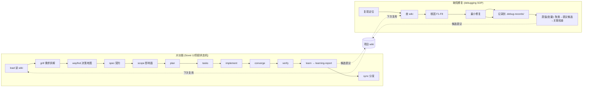
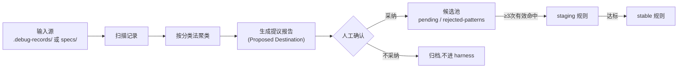
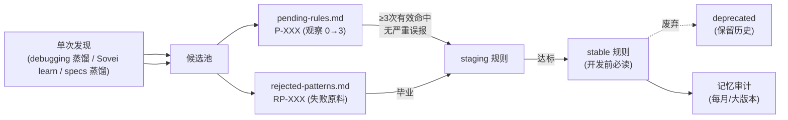
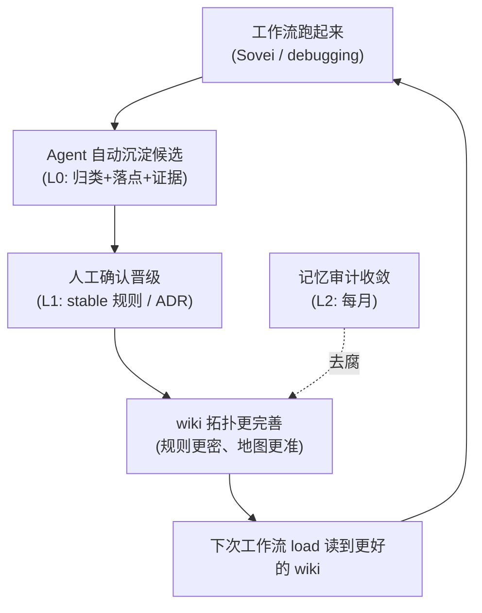

# 研发工作流使用手册

本手册是 `harness/workflows/` 的总入口,回答三个问题:**什么场景用哪个工作流、每个工作流怎么读写项目 wiki、整套流程怎么越用越完善**。

各工作流的阶段细节见各自的子手册:
- Sovei 12 阶段:[sovei/USAGE.md](sovei/USAGE.md)
- 缺陷修复 SOP:[systematic-debugging.md](systematic-debugging.md)
- SpecKit SDD:[speckit/workflow.yml](speckit/workflow.yml)

已注册工作流清单见 [workflow-registry.json](workflow-registry.json)。

## 1. 工作流总览

| 工作流 | 版本 | 定位 | 知识读取 | 知识沉淀 |
|---|---|---|---|---|
| `sovei-workflow` | 1.1.0 | 大功能研发,12 阶段状态机 | `load` 按任务域加载 | `learn` 生成 learning-report 提议 |
| `systematic-debugging` | 1.0.0 | 缺陷修复,6 步 SOP | 第 2 步查 harness | 第 5 步按 A-E 分发沉淀 |
| `speckit` | 1.0.0 | SDD 全周期(specify→plan→tasks→implement) | 读 spec-harness 规则 | 偏向实现交付,沉淀走蒸馏 skill |
| `speckit` | 1.0.0 | SDD 全周期(specify→plan→tasks→implement) | 读 spec-harness 规则 | 偏向实现交付,沉淀走 Sovei `learn` |

三者共用同一套项目 wiki(`memory/` + `spec-harness/` + `codegraph/`),沉淀落点统一,区别只在**粒度和状态机强度**:



## 2. 场景选择

| 场景 | 用哪个 | 理由 |
|---|---|---|
| 新功能 / 需求变更 / 跨模块改动 | Sovei 完整流程 | 需要契约、影响面、任务拆解和验收证据 |
| 需求还有业务选择未定 | Sovei `grill`(可重复) | 逐项确认决策,未清零不实现 |
| 大型或高不确定需求 | Sovei + `wayfind` | 决策地图消除规划前未知 |
| 线上 bug / 报错 / 行为异常 | systematic-debugging | 6 步 SOP,强制记录 |
| 小型明确修复(文案/配置) | systematic-debugging 走简版 | 复现→查 wiki→修复→记录,不蒸馏 |
| 已有 spec 想走 SDD 全周期 | speckit | specify→plan→tasks→implement 带门禁 |
| 只查询或解释代码 | 都不用 | 直接用 `knowledge-loader` 读 wiki |

**一句话判断**:要产出 Feature Artifact(契约、影响面、任务、证据)→ Sovei;要修一个具体缺陷 → debugging;要查代码 → 都不进工作流,直接读 wiki。

## 3. 大功能研发工作流(Sovei)

### 命令格式

```text
# Codex
$sovei-workflow <stage> FEATURE=specs/<feature>

# Claude Code
/sovei/<stage> FEATURE=specs/<feature>

# CodeBuddy
命令面板 SOVEI: <stage>,参数 FEATURE=specs/<feature>

# Trae
使用 sovei-workflow skill 执行 <stage> FEATURE=specs/<feature>
```

每次只执行一个阶段,Agent 输出下一条命令后必须停止。阶段顺序、停止条件和返工规则见 [sovei/USAGE.md](sovei/USAGE.md)。

### 需求拆解 = Sovei 前半段

"需求拆解工作流"不是独立工作流,而是 Sovei 的 `grill → wayfind → spec` 三阶段:

| 阶段 | 做什么 | 产出 |
|---|---|---|
| `grill` | 一次只问一个决策,提供推荐答案;能查到的不问用户 | `decision-log.md` |
| `wayfind` | 画决策地图,区分可回答票、阻塞、未知区 | `wayfinder.md`(短任务可 N/A) |
| `spec` | 固化需求契约、验收场景、明确排除项 | `spec.md` |

需求拆解的产出直接喂给 `scope`(影响面)和 `plan`(技术方案),不需要切换工作流。

### 知识复用点

- **读**:`load` 阶段用 `knowledge-loader` 按任务域加载 wiki(不是全量塞入)。Bug 类加载 `vue-pitfalls` + `systematic-debugging`;架构类加载 `project-architecture`;实现类加载 `implementation-rules`。
- **写**:`learn` 阶段生成 `learning-report.md`,用 Observation / Classification / Evidence / Scope / **Proposed Destination** 表格提议沉淀落点。**不会自动晋级稳定规则**,底部 `Manual Review Required` 是人工闸门。
- **分发**:`sync` 把已授权知识分发到 A/B/C 工程,完成后进入终态。

## 4. 缺陷修复工作流(systematic-debugging)

### 6 步 SOP 速查

```text
复现定位 → 查 harness 知识 → 根因分析(归类 F1-F8) → 最小修复 → 知识沉淀 → 关联检查
复现定位 → 查 harness 知识 → 根因分析(归类 F1-F8) → 最小修复 → 记录(必做) → 蒸馏(批量)
```

完整步骤见 [systematic-debugging.md](systematic-debugging.md)。

### 两段式:记录与蒸馏分离

缺陷修复采用"写快、判慢"的两段式,修完只记录,判断通用性留到批量蒸馏:

- **第 5 步 记录(每次必做)**:修完立刻写一条结构化记录到工程根下 `.debug-records/`(IDE 无关,与 `specs/` 同级,不参与 sync 分发)。只记事实(症状/根因/修复/文件/F 类型),不判断"值不值得进 wiki"。
- **第 6 步 蒸馏(批量,手动触发)**:攒够记录后(建议 ≥10 条或每月一次),用蒸馏 skill 扫描 `.debug-records/`,按 F 类型聚类,重复出现的提议进 `pending-rules.md` 或 `rejected-patterns.md`(候选,不晋级),单次的归档。

> 为什么不修完当场判断?修完那个瞬间判断不出这条经验是模式还是偶然。很多坑要重复出现两三次才知道。先记,后判。

A-E 分发(判断落点)发生在蒸馏阶段,不是记录阶段:

| 情况 | 落点 | 例子 |
|---|---|---|
| A:典型 Vue 陷阱/框架特性坑 | `project/memory/vue-pitfalls.md` | watch 时序、ref 解包 |
| B:违反已有规则但规则不够明确 | `project/rules/implementation-rules.md` 补充 | 规则缺具体要求 |
| C:新发现的架构模式问题 | `project/rules/rejected-patterns.md` RP-XXX | 多入口绕过组件 handler |
| D:重要架构决策 | `project/memory/design-decisions.md` 新 ADR | 模块边界调整 |
| E:临时性,无通用价值 | 不进 harness,记录归档即可 | 一次性数据问题 |

蒸馏后关联检查保证拓扑一致:新增 pitfall 后回头看 `implementation-rules.md` 要不要补规则、`knowledge-loader` 关键词触发表要不要加词、`codegraph` 链路描述要不要更新。

### 与 Sovei `learn` 的关系

三者喂同一个 wiki,粒度不同,共用一个蒸馏 skill(详见 §5):

- **debugging 沉淀**:单点缺陷 → `pending-rules.md`(P-XXX)或 `rejected-patterns.md`(RP-XXX),都是**候选**
- **Sovei `learn` 沉淀**:Feature 级偏差 → `learning-report.md` 提议落点
- **specs 蒸馏**:多个 Feature 的 specs 产物 → 按业务能力聚类提议
- **共同路径**:候选 → 观察 ≥3 次有效命中 → 人工确认 → `implementation-rules.md` staging → 达标转 stable

### debugging 不升级为状态机(已分析)

debug 是快进快出的,一个 bug 通常一次会话内修完就走,不需要跨会话恢复进度。状态机的 `reopen` 对线性流程价值很低——它不存在"发现早期契约错了要回退整条链"的场景。如果沉淀遗漏真成了反复出现的模式,更合理的做法是加一个轻量 gate(沉淀模板必填 + 沉淀完成才算结案),而不是整套状态机。

## 5. 蒸馏:共享知识提取能力

debug 记录、Sovei learn、specs 蒸馏三个场景的机制完全一样(扫描 → 分类 → 提议候选 → 人工确认 → 写 harness),只是输入源不同。因此抽一个共享的蒸馏 skill,而不是写三份 SOP。

### 蒸馏 skill

IDE 无关,放 `.agents/skills/distill/`(与 `knowledge-loader` 同级)。核心逻辑:扫描指定路径 → 按分类法聚类 → 生成提议报告(带 Proposed Destination)→ 人工确认 → 写入 harness 对应文件。

| 调用方 | 输入源 | 分类法 | 触发时机 |
|---|---|---|
| debugging 蒸馏 | 工程根 `.debug-records/` | F1-F8 | 手动,≥10 条或每月 |
| Sovei `learn` | `specs/<feature>/` | Observation/Classification | Feature 结束时 |
| specs 蒸馏 | `specs/` 多个 Feature | 按业务能力/模块 | 手动,批量 |

三个入口共享同一个"提议不晋级"闸门:skill 只生成候选(pending / rejected-patterns / learning-report),stable 晋级仍需人工确认。

### 蒸馏流程



### debug 记录目录约定

- **位置**:工程根下 `.debug-records/`,与 `specs/` 同级
- **IDE 无关**:不放在 `.codebuddy/memory/`(那是 IDE 对话总结,会被覆盖)、不放在 `.agents/`、`.trae/` 等 IDE 私有目录
- **sync 保护**:与 `specs/` 同级别,不读不写不删,不参与中枢分发
- **记录格式**:见 [systematic-debugging.md](systematic-debugging.md) 第 5 步模板

> `.debug-records/` 是工程实例状态,不是中枢稳定知识。它的价值是给蒸馏 skill 提供原料,本身不分发。

> **路径约定**:本文档内 `memory/`、`spec-harness/`、`codegraph/` 均指 harness 根下的相对路径。中枢里是 `harness/memory/`,分发到工程后对应 `.specify/memory/`。knowledge-loader SKILL 用 `<harness-root>` 变量自动解析,不需要手动区分。

## 6. 知识复用闭环

### 读:按任务域加载

`knowledge-loader` Skill 的加载规则见 [.agents/skills/knowledge-loader/SKILL.md](../../.agents/skills/knowledge-loader/SKILL.md)。核心纪律:**宁可多读,不要漏读;但只加载当前任务需要的直接资料,不一次性注入全部 Memory**。

| 任务域 | 加载 |
|---|---|
| Bug / 报错 / 调试 | `vue-pitfalls.md` + `systematic-debugging.md` |
| 架构 / 拆分 / 模块化 | `constitution.md` + `project-architecture.md` |
| 技术决策 / ADR | `design-decisions.md` |
| 实现 | `implementation-rules.md` |
| 代码导航 | `project/codegraph/index.md` 及直接链接的地图 |

### 沉淀:候选 → 观察 → 晋级



**晋级纪律**(宪法约束):单次观察进入候选,不直接写成稳定规则。`≥3 次有效命中且无严重误报`才可毕业。详见 [project/rules/pending-rules.md](../project/rules/pending-rules.md) 和 [rejected-patterns.md](../project/rules/rejected-patterns.md)。

### 收敛:记忆审计

[spec-harness/memory-audit-checklist.md](../spec-harness/memory-audit-checklist.md) 五个维度:时效性(引用文件还在不在)、一致性(ADR 与规则对不对齐)、冗余性(同知识点分散 3+ 处就收敛)、蒸馏状态(30 天以上日志提炼后删除)、CodeBuddy 适配。建议每月 1 次或大版本合并后触发。

## 7. 降低人工审核成本

现有宪法明确"不自动将单次观察升级为稳定规则"(design-doc §2.2),蒸馏 skill 的"提议不晋级"是硬闸门。**降本不靠打破闸门,靠让机器做更多前置工作,人工只做最终确认**。

### 分层审核模型

| 层 | 执行者 | 做什么 | 现状 |
|---|---|---|---|
| L0 机器自动 | Agent / 蒸馏 skill | 归类 F1-F8、聚类、填 Proposed Destination、统计命中次数、跑关联检查清单 | debugging SOP 已含归类;蒸馏 skill 待实现;命中统计待自动化 |
| L1 人工确认 | 开发者 | 确认晋级(staging→stable)、确认 ADR、确认废弃 | 当前全部人工 |
| L2 定期审计 | 开发者 | 记忆审计 checklist(每月) | 已有 checklist,需手动跑 |

降本方向是**把 L1 从"全量审查"压成"确认机器提议"**:L0 把归类、落点、证据、关联影响都填好,L1 只看"这个提议对不对"然后拍板。

### 可立即落地的降本动作

1. **debugging 记录**:第 5 步只记事实不判断,认知负担降到最低,Agent 自动填模板。
2. **蒸馏 skill 批量提议**:攒够记录后一次蒸馏,Agent 做聚类+填表,开发者只审"提议→是否采纳"。
3. **命中统计自动化**:蒸馏 skill 扫描 `.debug-records/` + `rejected-patterns` 数同一类失败出现几次,不再人工翻日志。
4. **关联检查清单化**:蒸馏后三条检查项作为 skill 自动执行的 checklist,减少人工补查。
5. **记忆审计脚本化**:A1 时效性(引用文件是否存在)可由脚本扫描,人工只处理脚本标记的 stale 条目。

### 仍需人工的边界(不自动化)

- stable 规则晋级:必须人工确认证据充分、适用范围正确。
- ADR 采纳/废弃:架构决策不可自动拍板。
- 跨工程分发:必须显式 `TARGET` 授权,`sync` 不自动 Pull。

## 8. 知识飞轮



飞轮转得起来的三个前提:
1. **debugging 第 5 步记录和 Sovei `learn` 是"必须完成"项**,不是可选。
2. **候选→stable 有证据阈值过滤**,噪声不污染 wiki。
3. **蒸馏关联检查 + 记忆审计保证拓扑一致**,知识成网不成堆。

飞轮转得越快,wiki 越准,`load` 读到的上下文越好,Agent 重复踩坑越少,L1 确认越快。这就是"越用越完善、审核成本递减"的机制。

## 9. 待决项

以下涉及实现工作或宪法边界,需走对应流程:

| 待决项 | 当前状态 | 变更门槛 |
|---|---|---|
| ~~debugging 是否升级为状态机~~ | **已分析:不升级** | debug 快进快出,状态机增加摩擦无收益;沉淀遗漏改用轻量 gate |
| 蒸馏 skill 实现 | 设计完成,待实现 | 需创建 `.agents/skills/distill/`,实现扫描+聚类+提议 |
| pending→stable 自动晋级阈值 | 人工确认 | 现有候选样本太少,需先跑起来攒数据再评估 |
| 记忆审计脚本化 | 人工 checklist | A1 时效性扫描可先行,其余维度按需脚本化 |
| speckit 沉淀衔接 | 走蒸馏 skill | specs 蒸馏是蒸馏 skill 的第三个入口,已纳入设计 |

变更 SOP 或宪法时,使用 `$sovei-workflow reopen TARGET=<stage> REASON=<reason>` 失效相关阶段,不手工改 `workflow-state.yaml`。
