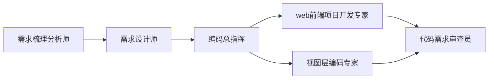

# EC Web AI 插件市场

EC 团队前端专属 VS Code Copilot 智能体插件市场，集成编码规范、自定义 Agent、技能、OpenSpec 工作流和 ec-design MCP 服务，覆盖从需求分析到代码审查的完整前端研发链路。

---

## 插件列表

| 插件 | 版本 | 说明 |
|------|------|------|
| [ec-web-ai-plugin](./ec-web-ai-plugin) | 1.0.0 | 包含业务分析、三层架构代码生成、OpenSpec 设计讨论及编码审查的研发套件 |

---

## 安装

将本仓库注册为 VS Code Copilot 插件市场：

```json
// settings.json
"chat.marketplaces": {
    "ec-web-ai": {
        "source": "https://github.com/your-org/web-plugins.git",
        "plugins": ["ec-web-ai-plugin"]
    }
}
```

> **注意**：Agent Plugin 目前为预览功能，需确保 `chat.plugins.enabled` 设置为 `true`。

---

## 核心能力一览

### 🤖 10 个专业 Agent — 覆盖完整研发链路

| Agent | 用途 |
|-------|------|
| **需求梳理分析师** | 从 PRD 提取项目范围内的 Web 前端需求，输出 `doc/` 需求梳理文档 |
| **需求设计师** | 前端主导设计业务数据结构与接口契约，生成 OpenSpec proposal |
| **编码总指挥** | 分析 change 依赖关系，并行/串行编排子 Agent 编码 |
| **视图层编码专家** | 根据 Figma 设计稿实现 React 组件、页面和样式 |
| **web前端项目开发专家** | 覆盖服务层、状态层、视图层的全栈编码，支持新建与修改 |
| **TypeScript 开发专家** | TypeScript 类型设计、代码重构、类型错误修复和工具函数编写 |
| **代码需求审查员** | 审查代码与需求文档、tasks.md 的一致性 |
| **业务报告生成** | 从业务视角分析项目页面和功能覆盖范围 |
| **交互链路分析师** | 梳理用户操作的接口调用时序 |
| **Explore** | 只读代码库探索与问答 |



### 🛠 11 个技能 — 编码规范 + 工作流 + 工具

**编码规范类 (2)**

| 技能 | 说明 |
|------|------|
| `coding-standards` | TypeScript、API、CLI、React、Rematch、Zustand、Web Worker、Less、文件命名和 Git 提交规范 |
| `vercel-react-best-practices` | Vercel React 性能最佳实践（打包、渲染、异步等） |

**工作流类 (5)**

| 技能 | 说明 |
|------|------|
| `openspec-explore` | 探索式分析代码库 |
| `openspec-propose` | 生成 OpenSpec change proposal |
| `openspec-apply-change` | 应用 OpenSpec change 到代码 |
| `openspec-archive-change` | 归档已完成的 change |
| `openspec-sync-specs` | 同步 spec 与代码实现 |

**工具类 (4)**

| 技能 | 说明 |
|------|------|
| `figma-component-implementation` | Figma 设计稿到 React 组件实现 |
| `ec-build-migration` | EC 项目构建迁移 |
| `grill-me` | 对方案和设计进行深度追问式审查 |
| `skill-authoring-standards` | 技能编写规范与模板 |

### 🔌 MCP 服务器

| 服务 | 类型 | 说明 |
|------|------|------|
| `ec-design` | HTTP | 组件库类型定义查询服务 |

---

## 使用方式

在 Copilot Chat 中通过 `@` 选择 Agent，`/` 调用技能：

```
@需求梳理分析师 /path/to/prd.md
@需求设计师 doc/需求梳理.md
@编码总指挥
@代码需求审查员
```

---

## 插件结构

```
web-plugins/
├── marketplace.json          # 插件市场定义
├── README.md                 # 本文件
└── ec-web-ai-plugin/
    ├── plugin.json           # 插件元数据
    ├── .mcp.json             # MCP 服务器定义
      ├── agents/               # 自定义 Agent（12 个）
        └── skills/               # 技能（6 个）
```

---

## License

Internal use by EC Frontend Team.
