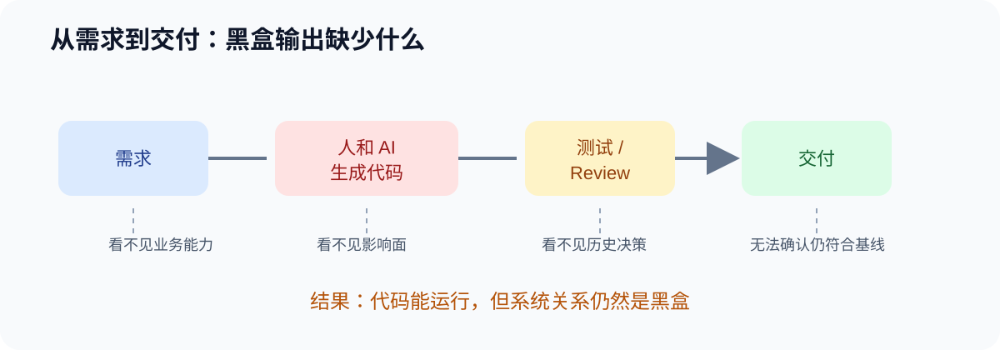
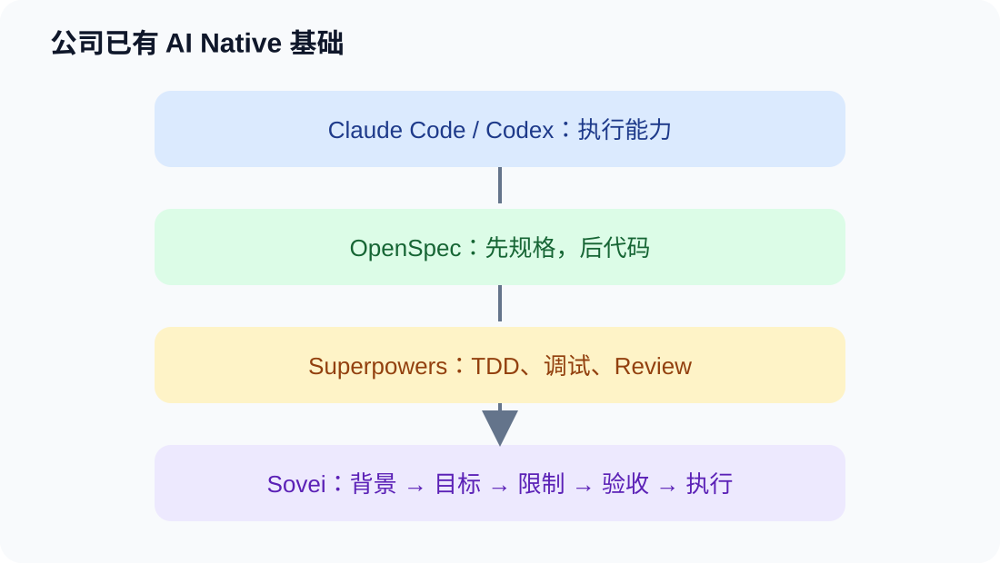
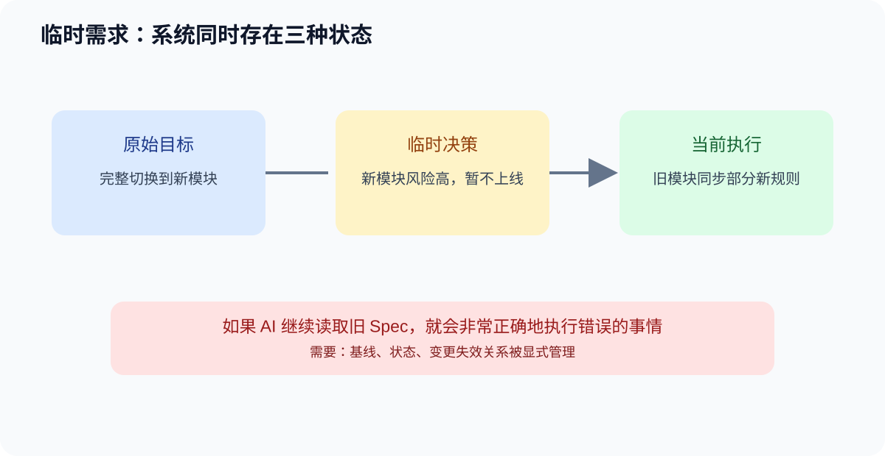
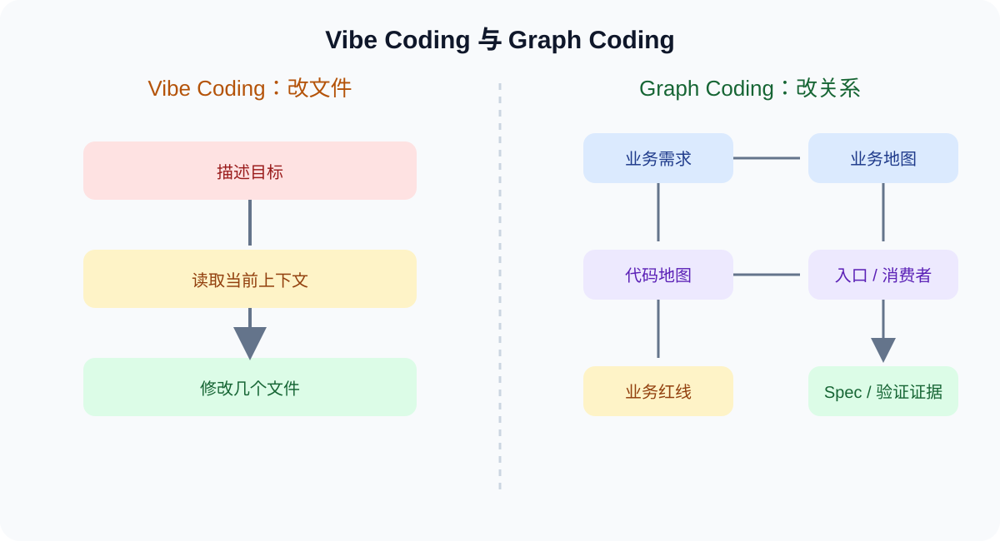
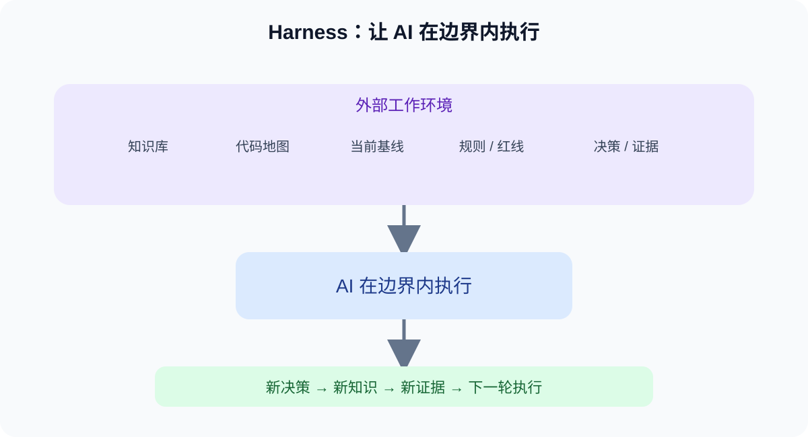
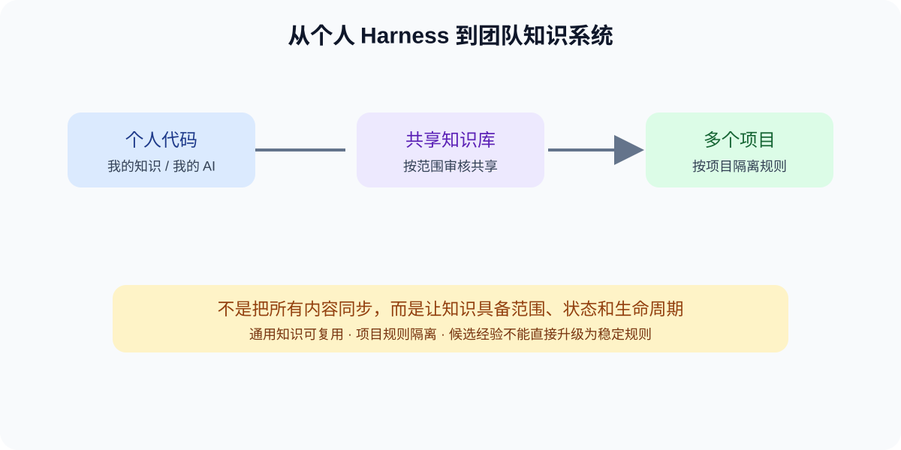
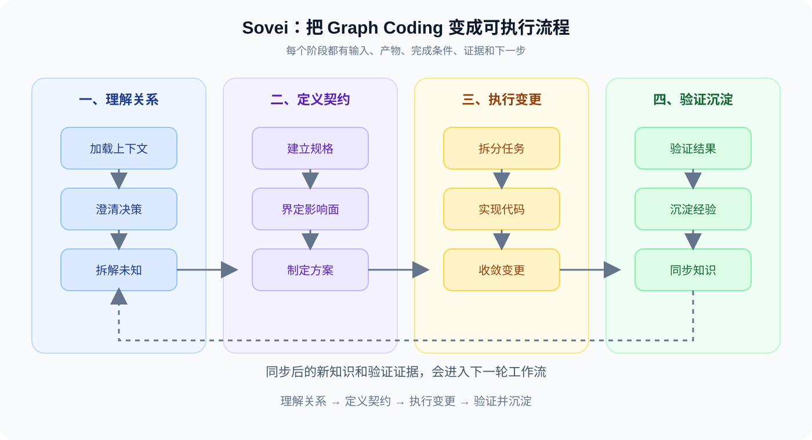

# 从 Vibe Coding 到 Graph-aware Coding



## 让 AI 在业务图谱中开发

### 这次分享只讲清楚一句话

> **当代码、业务、规则和需求变迁被连接成一张图，AI 才不只是“改文件”，而是在理解系统关系之后做变更。**

这不是一次 Sovei 功能介绍，也不是一次 AI 工具测评。Sovei 只是把真实开发中反复出现的痛点聚合起来，做成一套可以持续维护、持续验证的工程工具。

### 先说明一个实现边界

Sovei 的核心运行时（Stage、WorkflowEngine、KnowledgeStore、Artifact 校验、状态机、对账引擎）是自研的；同时它已具备一套**外部 Skill 运行时协议**，可以把第三方 Skill（如 Matt Pocock 的 grilling/domain-modeling/code-review、softaworks 的 lesson-learned）作为**提示词注入**接入对应阶段，失败时自动回退到原生提示。OpenSpec、Superpowers 则仍作为方法论参考和设计启发出现，尚未作为运行时接入。

---

## 一、那个让我开始重新思考开发方式的时刻

到 Q2 面对大约 200 万行代码时，我越来越清楚地意识到一件事：程序员已经不可能完整读懂整个系统。

这带来一个比“代码写得快不快”更基础的问题：

> **我们如何判断一段代码是正确的？它是否真的按照需求执行？它为什么会变成现在这样？**

很多时候，我们只能看到一个黑盒：

```text
需求 → 人和 AI 一起生成代码 → 测试 / Review → 交付
```

但中间缺少了几件事：

- 这段实现对应哪个业务能力？
- 它影响了哪些入口和消费者？
- 它遵守了哪些业务规则？
- 它继承了哪些历史决策？
- 需求变化后，这段代码是否仍然符合当前基线？

AI 的出现没有消除这个问题。相反，它让系统可以更快地产生更多代码，也让“黑盒输出”变得更大。

我的第一个判断是：

> **AI 编程首先需要的不是更长的 Prompt，而是一套能够持续沉淀知识和需求变迁的外部记忆。**

---

## 二、三个分散的痛点，其实是同一个问题

### 1. 单个项目：代码越来越难理解

人不可能记住整个代码库，也不可能只靠一次 Code Review 判断复杂 Feature 是否完整。

如果项目没有持续沉淀：

- 新人只能重新探索；
- AI 每次都要重新了解项目；
- 历史决策只能靠口头传递；
- 踩坑经验不会自动进入下一次开发。

### 2. 并行分支：每个产出都正确，合在一起仍可能错误

当多个分支、多个工程、多个 AI 会话并行工作时，问题不只是 Git 文本冲突：

- 两个分支可能修改同一个业务入口；
- 两个分支可能对同一条规则给出不同结论；
- 一个项目的红线可能被错误地同步到另一个项目；
- 两个 Agent 可能同时解决同一张决策票；
- 单独验证都通过，合并后业务语义却互相矛盾。

### 3. 临时需求：原本正确的方案突然变成错误执行

最危险的变化不一定是新需求，而是上线前的临时调整：

```text
原计划：完整切换到新模块
临时决定：新模块风险较高，暂不上线
但旧模块需要同步部分新模块规则
```

此时系统里同时存在原目标、当前过渡态和未来终态。AI 如果继续读取旧 Spec，就可能“非常正确地执行错误的事情”。

这三个痛点最终指向同一个问题：

> **AI 编程需要管理的不只是代码生成，还包括知识、状态、变更和协作产出的生命周期。**

---

## 三、公司已有方案解决了哪一层



公司之前的分享已经形成了很好的 AI Native 基础：

```text
Claude Code / Codex
        +
OpenSpec：先规格，后代码
        +
Superpowers：TDD、调试、Review
        +
背景 → 目标 → 限制 → 验收 → 执行
```

OpenSpec 把一次变更拆成 proposal、design、specs 和 tasks，让“先对齐方向、再写代码”成为可能。

Superpowers 把 TDD、系统化调试和代码审查带进当前开发会话。

这些方案解决了第一层问题：

> **AI 不应该从一句需求直接跳到代码，而应该先建立契约，再执行实现。**

但持续实践后还会出现下一层问题。

---

## 四、OpenSpec 和 Superpowers 解决不了的部分



OpenSpec 能帮助我们写清楚一次变更，但它不会天然保证：

- AI 读取的是当前生效基线，而不是旧 Spec；
- AI 找全了所有入口、消费者和验证面；
- AI 没有跳过某个关键阶段；
- 一个阶段真的完成了，而不是只生成了模板；
- 临时需求变化后，旧产物不会继续污染当前执行；
- 多分支之间没有业务语义冲突。

Superpowers 能改善当前会话的执行习惯，但它不负责：

- Feature 当前处于哪个阶段；
- 哪些产物已经完成并有证据；
- 哪些知识只是候选，哪些已经稳定；
- 哪个 Agent 拥有某个决策；
- 重大需求变化后哪些产物必须失效；
- 多个项目如何共同维护一套知识。

所以三者的关系不是替代，而是分层：

| 层 | 解决的问题 |
|---|---|
| OpenSpec | 这次变更要做什么、为什么做、怎么验收 |
| Superpowers | 当前实现过程应该如何更可靠 |
| Sovei | 如何让知识、状态、规则和证据跨会话、跨工具、跨项目持续生效 |

---

## 五、从 Vibe Coding 到 Graph Coding



Vibe Coding 更像是：

```text
我描述一个目标
→ AI 读取当前上下文
→ AI 修改几个文件
→ 人检查结果
```

Graph Coding 关注的是关系：

```text
业务需求
  ↕
业务地图 / 业务拓扑
  ↕
代码地图 / 模块关系 / 入口消费者
  ↕
业务红线 / 工程规则 / 历史决策
  ↕
Spec / Task / 实现 / 验证证据
```

业务系统本身就已经是一张图：用户、角色、业务能力、页面、状态、API、数据、异步链路和红线之间存在关系。

Sovei 要做的不是重新画一张孤立的图，而是把这些关系连接起来，让 AI 在修改一个代码入口时，同时知道：

- 它属于哪个业务能力；
- 它有哪些上下游消费者；
- 它受哪些业务红线约束；
- 它对应哪些验收场景；
- 它变化后哪些知识和验证需要重新检查。

Graph Coding 的核心不是“画图”，而是让关系可查询、可追溯、可校验，并且真正进入 AI 的执行上下文。

---

## 六、Harness 思维：Graph Coding 的工程底座



Harness 不是一个更大的 Prompt，也不是让 AI 自己运行到底。

它是一套持续维护的外部工作环境：

```text
项目知识库 + 代码地图 + 当前基线 + 工作流状态
          + 规则 + 红线 + 决策 + 验证证据
                         ↓
                AI 在边界内执行
                         ↓
          新决策 / 新知识 / 新踩坑回流
```

Harness 维护的不是某一次对话的答案，而是系统的上下文：

- 代码地图告诉 AI 代码在哪里以及如何连接；
- 业务地图告诉 AI 系统有哪些能力和边界；
- 业务红线告诉 AI 哪些事情不能做或需要审批；
- 决策记录解释为什么当前架构是这样；
- 踩坑记录避免同一个错误重复发生；
- 状态和证据告诉 AI 当前工作做到哪里、凭什么算完成。

个人阶段是：



```text
我的代码 → 我的知识 → 我的 AI
```

团队阶段会变成：

```text
项目 A ─┐
项目 B ─┼→ 团队共享知识库 → 按范围分发
项目 C ─┘
```

但共享不是把所有内容全部同步：通用知识可以审核后共享，项目专属规则必须隔离，Feature 状态不能跨项目覆盖，候选经验也不能直接升级成稳定规则。

---

## 七、Sovei 做的事情：把 Graph Coding 变成可执行流程



Sovei 是一个本地知识管理工作流引擎。它不定义“知识是什么”，而是定义“知识如何产生、验证、复用和失效”。

它将工作拆成 12 个阶段：

```text
load → grill → wayfind → spec → scope → plan → tasks
     → implement → converge → verify → learn → sync
```

真正重要的不是阶段数量，而是每个阶段都有输入、产物、完成条件、证据和下一步。

### 一个 Feature 如何被管理

`load` 负责加载项目知识和当前基线；`grill` 负责解决还没有说清楚的决策；大型工作进入 `wayfind`，把未知问题拆成可处理的决策票；`spec` 和 `scope` 分别描述需求契约和真实影响面；`plan`、`tasks` 和 `implement` 把方案变成代码；`converge`、`verify` 检查实现是否真的收敛；`learn` 和 `sync` 把有效经验回流到知识系统。

### 每个工作流节点到底在做什么

这 12 个节点不是把开发流程切得更碎，而是把一次业务变更中不同性质的问题分开处理。决策没有澄清时不进入规格，影响面没有查清时不开始设计，实现没有收敛时不宣称验证完成，单次经验也不会直接升级为团队规则。

| 工作流节点 | 这个节点解决什么问题 | 主要产物 | 当前实际 Sovei 能力 | 外部参考或未来适配对象 |
|---|---|---|---|---|
| `load` | 校验 Feature 的真实状态，加载当前基线、项目知识、业务红线和相关历史，避免 AI 凭聊天记忆开始工作 | 上下文包、知识来源清单、风险与下一合法阶段 | `sovei-workflow`、`knowledge-loader` | 暂无 |
| `grill` | 区分可查证事实、可推断决策和必须由用户确认的范围决策；一次解决一个关键问题 | `decision-log.md` | `sovei-workflow`、`knowledge-loader` | `mattpocock/grilling`（已接入）；备选 `grill-me`、`grill-with-docs` |
| `wayfind` | 面对大型或高不确定需求时，把未知区域拆成决策票据，标出依赖、阻塞、负责人和证据 | `wayfinder-events.jsonl`、`wayfinder.json`、`decision-tickets/*.json`、`wayfinder.md` | `sovei-workflow`、`knowledge-loader` | 已内化 `mattpocock/wayfinder` 的决策地图思想 |
| `spec` | 把 PM 原话翻译成稳定契约，说明做什么、不做什么、用户可见行为和验收条件，并与历史决策对齐 | `spec.md`、`reconciliation.md` | `sovei-workflow`、`knowledge-loader` | `mattpocock/domain-modeling`（已接入）；备选 `to-spec` |
| `scope` | 沿真实代码和业务链路追踪影响面，覆盖入口、状态、参数、I/O、异步回调、消费者、兼容路径和验证面 | `scope.md`、`coverage-matrix.md` | `sovei-workflow`、`knowledge-loader` | `mattpocock/domain-modeling`（已接入） |
| `plan` | 把需求契约和影响面转换成技术设计，定义模块边界、状态与数据流、接口契约、迁移和验证策略 | `plan.md` | `sovei-workflow`、`knowledge-loader` | `mattpocock/domain-modeling`（已接入） |
| `tasks` | 将方案拆成可独立实现、可独立验证的纵向任务，声明依赖、文件范围和完成标准 | `tasks.md` | `sovei-workflow`、`knowledge-loader` | `mattpocock/to-tickets`（已接入） |
| `implement` | 一次只执行一个已就绪任务，遵守业务红线和文件边界，保留无关改动，并记录实现与验证结果 | 代码变更、`change-manifest.md` | `sovei-workflow`、`knowledge-loader` | `mattpocock/implement`（已接入）；可吸收 Superpowers 的 TDD 与系统化调试纪律 |
| `converge` | 对照 Spec、Scope、Plan、Tasks 检查实现差距，将问题分类为缺失、部分满足、冲突或额外改动 | `convergence-report.md`、纠正任务 | `sovei-workflow`、`knowledge-loader` | `mattpocock/code-review`（已接入）；可吸收 Superpowers 的 Review 纪律 |
| `verify` | 分开验证需求符合性和工程质量，用测试、真实流程、日志或视觉结果形成可追溯证据 | `evidence.md` | `sovei-workflow`、`knowledge-loader` | `mattpocock/code-review`（已接入）；可吸收 Superpowers 的证据优先验证方式 |
| `learn` | 从决策、偏差、验证和架构变化中提炼经验，区分项目观察、候选知识和稳定规则；用 AI Skill 辅助蒸馏，并自动把观察对账回知识库按证据晋级 | `learning-report.md`、`knowledge-delta.md`、对账后的知识库 | `sovei-workflow`、`knowledge-loader`、`knowledge/reconcile.ts` | `softaworks/lesson-learned`（已接入）；参考 `mattpocock/handoff`、`juxt/allium/distill` |
| `sync` | 只同步经过审核且明确授权的知识、规则和报告，检查受保护路径和同步前后差异，完成本轮闭环 | `sync-report.md`、更新后的知识库 | `sovei-workflow`、`knowledge-loader` | 暂无 |

这张表还说明了 Sovei 与外部 Skills 的边界：表格中的“当前实际 Sovei 能力”指 Sovei 内部的阶段协议和运行时实现；而“外部参考或未来适配对象”表示方法论来源或候选集成方向。需要注意，Sovei 已经完成外部 Skill 运行时协议（`skill-map.yaml` 绑定、`skill-lock.yaml` 版本锁定、MarkdownSkillAdapter 注入、SkillInstaller/SkillUpgrader、失败回退 native），并已把 grilling、domain-modeling、to-tickets、implement、code-review、lesson-learned 等 Skill 作为提示词注入接入对应阶段。外部 Skill 是只读的提示词来源，不拥有 Sovei 的工作流状态。

### 为什么 `grill-me` 后面可能进入 `wayfind`

`grill-me` 和 `wayfind` 不是固定串联的两个第三方工具，而是对应两种不同的不确定性处理动作。`grill` 先把一个关键问题问清楚：哪些是事实，哪些是推断，哪些必须由需求方确认；如果问题澄清后影响面有限，可以直接进入 `spec` 或 `scope`。

只有当 `grill` 的过程中暴露出更大的未知区域，例如多个业务模块互相依赖、存在多个待决策分支、影响面尚未确定，才进入 `wayfind`。`wayfind` 的职责不是继续追问同一个问题，而是把未知区域拆成决策票，标出依赖、阻塞、负责人和所需证据。

```text
一个模糊问题
    ↓
grill：把当前关键决策问清楚
    ├── 影响面有限 → spec / scope
    └── 未知区域很大、依赖复杂 → wayfind
                                      ↓
                              决策地图与决策票
```

因此，两者的关系可以概括为：`grill` 负责纵向澄清一个决策，`wayfind` 负责横向展开一片问题空间。`wayfind` 是由问题复杂度触发的升级路径，不是所有 Feature 都必须经过的固定阶段。

每次调用只推进一个阶段。阶段可以明确标记为 N/A，但不能静默跳过。

`prepare` 也不等于 `complete`：CLI 可以准备上下文和模板，但只有真实产物通过校验，系统才会追加阶段完成事件。

---

## 八、最核心的实现：让状态成为事实，而不是聊天记忆

Sovei 使用事件溯源状态机：

```text
状态 = fold(events)
```

- `workflow-events.jsonl` 是只追加的事实源；
- `workflow-state.yaml` 是可以重建的缓存；
- `state-machine.ts` 用纯 reducer 从事件还原状态；
- Change Request 使用事件版本做乐观锁，防止并发变更互相覆盖。

这意味着，系统状态不依赖某个会话记得什么，也不依赖某个人手动修改 YAML。

---

## 九、知识不是聊天记录，而是有生命周期的资产

Sovei 将知识分为 pitfall、rule、decision、code-map、architecture、preference 和 constitution，并使用生命周期：

```text
candidate → pending → stable → deprecated
```

一次观察只能成为 candidate，不能直接成为 stable。候选知识在 `learn` 阶段由对账引擎自动处理：新观察进入 candidate，重复证据累计到 2 条进入 pending，累计到 3 条（来自 3 个独立 Feature）自动晋级 stable。每次晋级都记录来源 Feature 和证据，stable 晋级会单独标记为"自动晋级、需事后审查"，可用 `sovei knowledge review` 查看、用 `deprecate` 回退误判。知识库里的扫描候选仍要人工核对 codeEvidence，但 learn 阶段沉淀的 Feature 经验按"信任但可验证"的方式自动进入 AI 复用的知识集合。

例如扫描器曾经因为关键词把 `authentication` 和 `billing` 判成项目能力。回到 `codeEvidence` 核对后，发现命中的是关键词表、测试或 DI token，而不是真实业务逻辑，于是这些候选被拒绝。

这体现了一个原则：

> **AI 可以帮忙发现候选，也可以用多源证据让经验稳定；事实确认仍由人工掌握回退权。**

---

## 十、一个真实案例：AGENTS.md 为什么不能被静默覆盖

`project init` 原本会用硬编码模板生成 `AGENTS.md`。后来人工在文件中补充了门禁说明，重跑 init 时，人工内容被无条件覆盖。

表面上这是一个文件覆盖 Bug，真正的根因是两个事实源同时存在：源码中的模板是一份，实际被人工维护的 `AGENTS.md` 是另一份。

这个 Feature 通过 Sovei 的流程处理：

```text
事实核实 → 问题界定 → 影响面分析 → 方案选择
→ 任务拆解 → 实现 → 三种路径验证 → 学习沉淀
```

最终行为是：已有 `AGENTS.md` 时不覆盖，输出一条可交给 AI 审查和同步的提示指令；只有用户显式传入 `--force` 才覆盖。

这个案例说明，Sovei 不只是帮助 AI 写功能，也帮助我们把工具自己的隐性风险显式化。

---

## 十一、Sovei 是怎样用自己的流程迭代自己的

痛点来自真实业务开发，而不是因为开发 Sovei 才发现问题。Sovei 建成之后，才开始用这套流程验证自身：

```text
真实业务痛点
→ 抽象成 Sovei
→ 用 Sovei 开发 Sovei
→ 发现流程缺口
→ 继续完善 Sovei
```

`specs` 中有一条清晰的迭代链：

```text
004 发现旧版 onboarding 产物需要版本守卫
→ 005 发现守卫过度阻断，修正边界并补 CLI 集成测试
→ 006 发现阶段声明与真实执行链断开，修复 workflow contract
→ 007 发现文档中的静态模板已不是运行时事实，删除死模板
→ 011 发现清理引入的测试回归，并修复 AGENTS.md 覆盖问题
```

另一条能力链是：

```text
001 Monorepo 扫描
→ 002 知识快照、Context Pack 和 Adapter
→ 003 CLI 自举、规则生命周期和发布加固
→ 008 Review Gate 与确认依据对齐
```

最近把外部 Skills 与学习闭环补上：

```text
012 外部 Skill 配置层（map/lock/CLI/渲染）
→ 013 Skill 与 Agent 上下文集成（AGENTS.md 等渲染）
→ 014 Skill 运行时层（MarkdownSkillAdapter 注入 + 安装/升级治理）
→ 015 learn 阶段知识自动对账引擎（reconcile.ts，闭合 learn→knowledge 循环）
→ 016 learn 接入第三方 Skill（softaworks/lesson-learned）并融合蒸馏方法论
```

这里能验证的不是“效率提升了多少”，而是：

- 问题可以被写成明确的 Feature；
- 过程可以跨会话恢复；
- 代码改动可以回到 Spec 和决策；
- 验证结果可以留下证据；
- 新问题可以进入下一轮工具迭代。

收益数据目前还没有完成长期统计，所以这次分享不宣称具体提效比例。

---

## 十二、公司已有痛点与 Sovei 的覆盖边界

| 已观察到的问题 | Sovei 的处理 | 当前状态 |
|---|---|---|
| 规格容易被跳过 | 阶段门禁、Artifact 校验 | 已实现 |
| 简单任务也被重流程覆盖 | S0 / S1 / S2 风险分级 | 已实现 |
| AI 执行时漏掉影响面 | Scope、Coverage Matrix、Converge、Verify | 核心已实现 |
| config 和规则会过期 | Scanner、Rules、Context Snapshot | 部分解决 |
| 跨工具切换需要重新解释 | 状态文件、事件、Context Pack、Adapter | 基础已实现 |
| 经验无法复用 | 类型化知识、生命周期、learn 对账引擎 | 已实现（自动晋级 stable + 事后回退） |
| 多项目公共规范重复维护 | Hub / 卫星同步方向 | 部分实现 |
| 外部 Skill 无法接入 | 运行时协议、map/lock、adapter 注入、install/upgrade | 已实现 |
| 学习经验只写报告不回库 | learn 阶段 reconcile 自动对账到知识库 | 已实现 |

还有一些目前明确没有完全解决：业务拓扑变化后的自动影响评估、分支级红线隔离、业务语义 merge preflight、知识复用价值阈值，以及统一关系模型驱动的自动影响分析。

这部分需要诚实表达：

> **Sovei 当前是稳定版的工作流治理内核，不是已经完成的企业级 Agent 平台。**

---

## 十三、最后留下的三句话

第一，代码规模增长之后，程序员不可能靠阅读记住整个系统，知识、决策和证据必须成为代码之外的长期资产。

第二，AI 编程真正困难的不是生成代码，而是确认它读取了正确的基线、理解了正确的业务关系，并且完成了正确的验证。

第三，OpenSpec 让 AI 有契约，Superpowers 让 AI 有习惯，Sovei 把业务图、代码图和规则图连接起来，让 AI 从 Vibe Coding 走向 Graph-aware Coding。

---

## 十四、我们现在是不是 Graph Coding

严格来说，Sovei 还没有完整实现 Graph Coding。更准确的说法是：

> **Graph-aware Coding 的基础设施已经开始形成，但关系图还没有完全变成可自动推理、可自动影响执行的统一系统。**

目前已经具备业务地图、代码地图、业务红线、Context Pack、Scope、Coverage Matrix、Wayfinder，以及连接需求、实现和验证的 Spec / Task / Evidence。

但距离最终 Graph Coding 还差几层：

1. 这些图之间需要统一的关系模型，而不是分散在不同 JSON、文档和模块中；
2. 业务需求变化后，需要自动重新计算受影响的代码、规则和验证面；
3. 代码修改后，需要反向更新代码地图和业务地图，形成双向同步；
4. 分支合并时，需要自动发现没有 Git 文本冲突、但存在业务语义冲突的情况；
5. AI 需要根据关系图自动生成最小且正确的上下文，而不是主要依赖阶段规则和人工组织。

### 差距主要来自哪里

当前差距既有架构问题，也有实现问题，但主要不是架构方向错误：

- 架构方向已经覆盖了知识、状态、关系、规则和证据这些基础层；
- 更大的差距是关系模型还没有完全统一，自动影响分析、图之间同步和语义合并能力还没有开发完成；
- 部分能力已经有雏形，但还停留在扫描结果、静态产物或人工触发阶段。

### 最终想实现的效果

用户提出一个业务需求后，系统能够沿着业务地图定位业务能力，沿着代码地图找到入口和消费者，读取适用的业务红线和历史决策，生成当前有效的 Spec 和任务，执行代码修改，并自动列出需要重新验证的业务场景。

AI 最终回答的不只是“应该改哪个文件”，而是：

> **这次需求改变了业务图上的哪条关系？会影响哪些代码和消费者？受到哪些规则约束？哪些旧结论失效？修改完成后凭什么确认它是正确的？**

这才是 Graph Coding 想达到的最终形态。

---

## 十五、Graph Coding 现在有没有可复用的三方工具

Graph Coding 目前还不是一个统一的产品类别，也没有一个三方轮子可以直接覆盖业务图、代码图、Spec、规则、状态、验证证据和 Agent 执行的完整链路。

但是，生态中已经有很多可以复用的能力：

| 能力层 | 可复用工具 | 主要解决的问题 |
|---|---|---|
| 代码地图 | Tree-sitter、SCIP、CodeQL、Joern | 代码结构、调用关系、依赖关系 |
| 项目依赖图 | Nx Project Graph、Madge、dependency-cruiser | 模块和工程之间的依赖 |
| 规则与红线 | Semgrep、CodeQL、ArchUnit | 代码规则、架构约束和安全校验 |
| 图存储与查询 | Neo4j、Memgraph | 业务、代码、规则之间的关系 |
| Graph RAG | Microsoft GraphRAG、LlamaIndex Property Graph | 基于关系检索上下文 |
| Agent 工作流 | LangGraph | 多阶段、可恢复的 AI 执行流程 |

因此，Sovei 不是重新发明这些基础能力，而是在它们之上补充一层“关系统一与工程治理”：

```text
代码分析工具 → 生成代码地图
图数据库     → 保存业务图、代码图、规则图
规则引擎     → 校验业务红线和架构约束
Agent 工作流 → 执行可恢复的开发阶段
Sovei        → 把这些关系连接到一次真实的业务变更
```

更准确的定位是：

> **三方工具解决“如何分析某一类关系”，Sovei 解决“这些关系如何共同影响一次开发决策”。**

### 下一阶段的开发重点

我们不需要一开始就替换所有现有工具，而应该优先建立自己的关系模型和适配层：

1. **统一关系模型**：定义业务能力、代码入口、模块、规则、Spec、Task、Evidence 之间的关系；
2. **代码地图适配器**：优先接入 Tree-sitter、SCIP 或现有扫描器，生成可追溯的代码节点和边；
3. **影响分析引擎**：需求、代码或规则变化后，自动计算受影响的上下游关系；
4. **图查询上下文**：根据关系图生成最小上下文包，减少 AI 依赖人工拼接信息；
5. **语义合并预检**：在分支合并前发现 Git 文本冲突之外的业务语义冲突；
6. **验证证据回流**：把验证结果反向写回关系图和知识生命周期。

这条路线说明：Sovei 当前的架构方向是成立的，下一步不是推倒重来，而是把已经存在的知识、状态、规则和证据，进一步统一成可以查询、推理和自动影响执行的关系系统。
